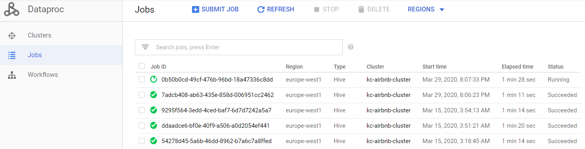

# Proyecto final – _Airbnb Ocio Madrid_

* [Introducción](#introducci-n)
* [Estrategia](#estrategia)
* [Arquitectura](#arquitectura)
* [Fase I (Prueba de Concepto)](#fase-i-prueba-de-concepto)
* [Exploración de datos](#exploración-de-datos)
* [Flujo de trabajo](#flujo-de-trabajo)
* [Desarrollo](#desarrollo)
* [Deployment](#deployment)
* [Mejoras fase I](#mejoras-fase-I)
* [Fase II (Evolución)](#fase-ii-evolución)
* [Referencias](#referencias)

## Introducción
Como parte del proyecto final del **Bootcamp Big Data & Machine Learning de KeepCoding**, y continuando con el dataset que Airbnb que se ha ido utilizando a lo largo del curso, se plantea el desarrollo y despliegue de una arquitectura para llevar a cabo las fases de ingesta, almacenamiento y visualización de los datos.

Sin centrarnos en lo que sería la idea de negocio de la aplicación, el objetivo de este trabajo se basa en desarrollar una posible solución de arquitectura a través de las tecnologías disponibles en la plataforma **Google Cloud Platform**. Para ello en los diferentes aparatados se hará hincapié en:

-	Tecnologías utilizadas
-	Fuentes de datos
-	Ingesta
-	Despliegue de la solución
-	Visualización de resultados
## Estrategia
Desarrollar una herramienta que nos recomiende los alquileres de Airbnb en función de la oferta de ocio de los distintos barrios de Madrid. De modo que podríamos titularla como **Airbnb Ocio**.

Al buscar alojamiento es importante estar cerca de ciertas áreas turísticas, pero también es interesante saber la proximidad que se tendrá a ciertos lugares como restaurantes, supermercados, tiendas, así como conocer ciertos eventos locales que se celebrarán en los próximos días.

Se trata de un sistema que diariamente recomiende a los usuarios aquellos alquileres considerados con mayor oferta de ocio y lugares de interés en sus alrededores, todo ello a partir de la recopilación y análisis de distintas fuentes de datos.

Todas las tecnologías y desarrollos se desplegarán en la nube, evitando de esta manera cualquier tipo de gestión y mantenimiento por parte del cliente. 

## Arquitectura
La arquitectura planteada se basa en disponer de un sistema totalmente gestionado en la nube y con tecnologías que puedan escalar bajo la necesidad de ampliar los recursos por una mayor demanda o incluso añadir nuevos servicios de interés para el negocio planteado.

Las preguntas planteadas a la hora de abordar la infraestructura son:
-	¿Con que frecuencia y dónde se procesarán las recomendaciones?
-	¿Dónde se almacenarán?
-	¿Cómo se podrán visualizar?

En este proyecto se plantean dos arquitecturas que se realizarían en distintas fases. La primera fase muestra la arquitectura básica para poder desplegar la idea presentada en un inicio. Ésta es la arquitectura que se ha desarrollado y desplegado a modo de prueba de concepto. Por otro lado, la segunda fase, plantea cómo podría abordarse una evolución o ampliación de los servicios ofrecidos a través de las tecnologías disponibles en la nube.
## Fase I (Prueba de Concepto)
A continuación, se muestra un diagrama con el flujo de datos y las tecnologías utilizadas para la implementación del proyecto:
  


Se distinguen los siguientes bloques y tecnologías:
### Fuentes de datos
El sistema recopilará además del dataset de Airbnb (Madrid), utilizado durante este Bootcamp, otras dos fuentes de datos adicionales.
#### Airbnb
Se trata del dataset utilizado a lo largo del Bootcamp. Es una fuente de datos independiente de Airbnb que muestra los alquileres que esta compañía tiene registrados a lo largo del mundo. Estos datos ya han sido analizados, limpiados y agregados para facilitar su consumo.
El dataset utilizado para la prueba de concepto no tiene una actualización continua de la información, de modo que se podría plantear como mejora el utilizar algún enlace o fuente con una frecuencia de actualización mayor.

Enlace al dataset:  
https://public.opendatasoft.com/explore/dataset/airbnb-listings/export/?disjunctive.host_verifications&disjunctive.amenities&disjunctive.features&q=madrid
#### Foursquare
Se han valorado varios proveedores y webs de datos geolocalizados, pero finalmente se optó por utilizar el proveedor Foursquare (servicio basado en geolocalización para descubrir lugares interesantes en las ciudades).

Algunos servicios o páginas valoradas han sido:
-	https://www.eltenedor.es/
-	https://www.tripadvisor.es/
-	https://www.yelp.es/madrid

Se probó a scrapear alguna de las webs anteriores, pero debido a su nivel de ofuscación y viendo que cada vez más las webs dificultan su extracción mediante estas prácticas, se optó por utilizar la API de Foursquare.

Se trata de una API muy fácil de usar, con datos bastante precisos y que alimentan otros servicios populares como Uber, Twitter, etc. además de ser un servicio utilizado por una gran comunidad de desarrolladores.

Las opciones gratuitas que nos ofrece Foursquare son más que suficientes para el desarrollo del proyecto (95000 llamadas a la API por día + 500 consultas premium), permitiendo:
-	Buscar puntos específicos de interés alrededor de una posición dada.
-	Explorar puntos de interés de tendencia o mejor valorados alrededor de una posición dada.

En este caso la frecuencia de actualización es continua.

El uso de esta API se ha realizado junto con los datos de del fichero GeoJSON **_neighbouhoods.geojson_** (http://insideairbnb.com/get-the-data.html). Este fichero contiene los límites de cada uno de los barrios de Madrid y se ha utilizado para calcular los centroides de cada barrio. Estos puntos son los que se utilizarán para obtener los lugares de interés recomendados por el servicio Foursquare.

#### Agenda de actividades y eventos de Madrid
Son datos publicados en la [web de datos abiertos de Madrid](https://datos.madrid.es/portal/site/egob/). Se trata de distinto tipo de actividades que se están celebrando o se van a celebrar, gestionadas por el Ayuntamiento de Madrid. Se pueden encontrar así las actividades de Centros Culturales, Socioculturales, Centros Juveniles, Bibliotecas, Centros de Mayores, Museos, Juntas de Distrito, etc.

Se dispone de distintos formatos csv, geo, xml, json,… y su frecuencia actualización es diaria.

En el apartado de exploración de datos se detalla más información sobre esta fuente.

Puedes obtener más información de esta fuente en este [enlace](https://datos.madrid.es/portal/site/egob/menuitem.c05c1f754a33a9fbe4b2e4b284f1a5a0/?vgnextoid=57be24206a91b510VgnVCM2000001f4a900aRCRD&vgnextchannel=374512b9ace9f310VgnVCM100000171f5a0aRCRD&vgnextfmt=default)

### Ingestión y almacenamiento
Para llevar a cabo el scraping e ingestión de las fuentes de datos seleccionadas, se ha optado por desarrollar unos scripts en Python que se almacenarán en la nube y que se ejecutarán cada cierto tiempo dependiendo de la naturaleza de los datos (diariamente, semanalmente,… ). Los datos obtenidos serán preprocesados, ejecutando ciertas transformaciones y limpieza, y finalmente se almacenarán en el servicio de almacenamiento de Google **GCS (Google Cloud Storage)**.

La plataforma de Google Cloud dispone de varias opciones para poder desplegar estos scripts y ejecutarlos de forma programada.

-	**Máquinas virtuales (VM)**: donde almacenar los scripts y programarlos mediante trabajos cron.
-	**Cloud Functions**: que permiten ejecutar en la nube código (node.js, python, …) sin necesidad de aprovisionar servidores. Su activación es por eventos, utilizando en este caso llamadas HTTP para su invocación.

Finalmente, se ha optado por las **Cloud Functions** en lugar de la solución de **VM** ya que solamente se necesitaba lanzar una ejecución de recuperación de datos con alguna transformación y limpieza. Además, esta opción permitiría fácilmente integrar las funciones en cualquier aplicación mediante las llamadas a estos endpoints a través de HTTP.

Otro de los servicios utilizados para la programación de los procesos de ingestión ha sido **Cloud Scheduler**, se trata de un programador de trabajos cron que permitirá ejecutar las distintas tareas de ingestión y procesamiento mediante las llamadas a los endpoint HTTP de las cloud functions.

### Procesamiento en batch
¿Con qué frecuencia y dónde procesará las recomendaciones? ¿dónde se almacenarán? Probablemente, baste con actualizar las viviendas recomendadas una vez por día o incluso una vez por semana. Es decir, en esta primera fase y acorde a la naturaleza de los datos el procesamiento a realizar será en __batch__.

Los distintos datasets ingestados en formato csv se almacenarán en el Cloud Storage de Google, y mediante una tecnología como **Hive** se llevarán a cabo tareas de transformación, carga y analisis de los datos. Esta tecnología permite trabajar con grandes volúmenes de datos y hacer consultas y analisis sobre ellos mediante lenguaje SQL como si se tratara de una base de datos relacional. Para utilizar esta tecnología se hará uso de dos servicios proporcionados por GCP:

-	**Cloud Dataproc**: Se trata de un servicio administrado para crear clústeres de Spark y Hadoop, y administrar cargas de trabajo de procesamiento de datos. Es la forma más rápida y fácil de crear un cluster mediante el aprovisionamiento de VM, configurarlo y ejecutar las tareas de Hive o Spark, y finalmente eliminarlo para que no genere ningún coste adicional.
-	**Cloud Storage**: En lugar de almacenar los datos en HDFS (sistema de ficheros distribuidos de Hadoop), se hará uso del almacenamiento proporcionado por Google (GCS), con el objetivo de desacoplar el almacenamiento del cómputo. Desplegando solamente el cluster de Hadoop cuando se tenga que hacer uso de las tecnologías de Hive o Spark.

Como se puede apreciar en el diagrama, el despliegue del cluster y la ejecución de las tareas de cómputo serán ejecutadas a través de **Cloud Functions** y activadas desde el servicio **Cloud Scheduler**.

### Visualización
En una primera fase, los resultados obtenidos se publicarán a través de la herramienta de colaboración **Slack**. Se trata de una forma simple en la que varios usuarios pueden unirse a un proyecto de Slack y mediante sus clientes móvil o web recibir las recomendaciones generadas por nuestra aplicación.

En otra fase posterior, se podría almacenar cierta información en bases de datos, como las ofrecidas por Google a través de servicios como BigQuery o Cloud SQL. De esta forma usuarios más avanzados pudieran hacer sus propios analisis y consultas a través de herramientas de exploración y análisis de datos como Microsoft Power BI, Tableau o Superset.
## Exploración de datos
Para la exploración de los datasets se utilizó el notebook [_analisis_datasets.ipynb_]( analisis_datasets.ipynb) que se puede encontrar en este repositorio.

En este notebook se hace un pequeño análisis de los datasets con el objetivo de explorar aquellas columnas que se quieren utilizar para la generación de las recomendaciones.

También se ha utilizado para extraer el dataset _neighbourhood.csv_ y hacer las pruebas de uso con la API de Foursquare.

## Flujo de trabajo
Debido a la naturaleza de los datos, en esta primera fase, las recomendaciones podrían ser diarias o semanales.  A continuación, se muestra un diagrama con el flujo de trabajo ejecutado para llevar a cabo el analisis y envío de las recomendaciones de forma programada.


1.	A partir de los barrios de Madrid en formato geojson, se ha generado un csv con el que poder llevar a cabo nuestro análisis. Este csv se cargará, en la fase de despliegue, en el directorio _gs://kc-airbnb/datasets/_ creado para almacenar todos los datasets. Para más información consultar el notebook [_analisis_datasets.ipynb_]( analisis_datasets.ipynb).
2.	El resto de datasets se extraerán mediante 3 programas python alojados en Cloud Functions. Se trata de 3 cloud functions que ejecutan la recuperación de los datos y los almacenan en el directorio _gs://kc-airbnb/datasets/_ en formato csv. Estas funciones se ejecutarán todas las noches de forma automática, mediante su programación con Google Scheduler.
3.	Se trata del programa encargado de realizar el análisis y recomendaciones de los alquileres de Airbnb. Este programa también es ejecutado de forma automática mediante una cloud function programada. Este programa se compone de varias fases:
    - Despliegue de un cluster hadoop con el que poder hacer los análisis.
    - Lanzar el análisis de las recomendaciones a través de unas consultas en Hive. Primero se cargarán las los datasets disponibles en tablas Hive y a continuación se ejecutarán las consultas necesarias (4).
    - El resultado obtenido se volcará en una tabla y en el directorio _gs://kc-airbnb/results/recommended_listings/_ para que pueda con ser consultado a posteriori (5).
    - Una vez finalizado el análisis, una función se encargará de leer el resultado y enviarlo a través de slack al canal configurado (6).
    - Para evitar cargos adicionales se eliminará el clúster de Cloud Dataproc una vez hay terminado el cálculo de las recomendaciones.

## Desarrollo
En este apartado se detallan los scripts desarrollados para implementar el proyecto propuesto, así como también aquellas tareas o scripts necesarios para su despliegue.

### Scripts 
#### Datasets
Los programas desarrollados para la extracción de los dataset se encuentran disponibles en el directorio **_scripts/_** de este repositorio.
-	**get_airbnb_data.py**: Funciones python para la descarga del dataset de Airbnb y preprocesado del csv. Se eliminan los caracteres de ‘new line’ que hay incluidos dentro de algunas descripciones del csv, ya que Hive no los puede manejar de forma correcta.
-	**get_events_data.py**: Descarga del dataset de eventos de Madrid y codificación en utf-8 para poder ser leído correctamente desde Hive.
-	**get_poi_data.py**: Función con la API de Foursquare para recuperar los lugares (puntos de interés) mejor valorados en cada uno de los barrios de Madrid. A partir del dataset neighbourhood.csv, cargado en la fase de despliegue, tenemos el centroide de cada barrio y será este punto el que se utilizará para buscar los puntos de interés recomendados por Foursquare.

Para poder utilizar la API de Foursquare de una manera mas eficiente, se ha optado por hacer las búsquedas solamente en los centroides calculados de cada barrio.

#### Procesado
**compute_recommendations.py**: este script tiene todas las funciones necesarias para llevar a cabo los siguientes pasos:
1.	Crear un cluster Hadoop en GCP, mediante el servicio Dataproc. El dimensionamiento del cluster se debería estudiar previamente, pero para nuestro ejemplo se ha optado por un cluster con 1 master y 2 workers básicos.
2.	Enviar un job de Hive al cluster para que se ejecute la carga/transformaciones de los datasets.
3.	Espera a la finalización del job de Hive.
4.	Enviar un job de Hive al cluster para que se ejecute de forma inmediata el análisis de las recomendaciones.
5.	Espera a la finalización del job de Hive.
Imagen con los Jobs ejecutados mediante el servicio Dataproc:



6.	Enviar los resultados mediante la plataforma Slack. Mediante el uso de templates y bloques proporcionados por la API de Slack se pueden generar mensajes con diseños más atractivos e incluso permitiendo interacción del usuario. A continuación, se muestra un ejemplo del layout generado con este script.


7.	Una vez terminado el analisis, el cluster será eliminado para no incurrir en gastos adicionales.

#### Hive sql
Se han generado dos scripts para procesar, mediante Hive, las recomendaciones de Airbnb. Estos scripts se pueden visualizar en el directorio **_scripts/sql/_** del respositorio.

-	**load_data.sql**: carga los csv en tablas para facilitar su procesamiento. También lleva a cabo alguna tarea de limpieza. 
Para la carga de los datos se ha utilizado la propiedad   SERDE 'org.apache.hadoop.hive.serde2.OpenCSVSerde', ya que puede escapar los separadores que se encuentran dentro de comillas dobles.
-	**compute_recommendations.sql**: son varias queries que calculan los alquileres con mayor oferta de ocio. Para ello se hace uso del cálculo aproximado de la distancia entre los eventos, lugares recomendados en Foursquare y las casas de Airbnb.

    - La primera consulta calcula el número de eventos por alquiler que se encuentran en su barrio y a una distancia max de 5 km.
    - La segunda consulta calcula Top de alquileres con mayor oferta de lugares de ocio recomendados, teniendo en cuenta que estén a menos de 2 km, pertenezcan a su barrio y además tengan más de 2 eventos programados para los próximos días. Finalmente se ordenan las recomendaciones por número de lugares recomendados y número de eventos próximos.

A continuación, se muestra una imagen con el cliente SQL (DBeaver) utilizado para realizar las pruebas sobre Hive.


## Deployment
Antes de poner en marcha el sistema de recomendaciones, hace falta llevar a cabo todas las tareas de despliegue en la plataforma GCP. A continuación, se describen las tareas realizadas.

La mayoría de tareas se podrían automatizar mediante el cliente _gcloud_ ofrecido por GCP, pero en este proyecto se han realizado mediante scripts de python o haciendo uso del **Google Cloud Console** y su interfaz gráfica para administrar los recursos.

Cualquier recurso o servicio desplegado en GCP tiene que pertenecer a un proyecto de modo que la primera tarea será crear un proyecto donde desplegar nuestro sistema.

Utilizar las APIs de Google para comunicarnos con la GCP desde nuestro equipo local requiere de un proceso de autenticación. Para ello se necesita crear un fichero con las credenciales necesarias para permitir una comunicación segura con nuestro proyecto. Los pasos a seguir son:

1. Crear una cuenta de servicio.
2. Rellenar los campos que nos pide y seleccionar crear clave de tipo json.


Configurando la variable GOOGLE_APPLICATION_CREDENTIALS con el path del fichero json con las credenciales, se podrá hacer uso de las APIs desde un equipo local.
### Buckets
**deploy_gs_kc-airbnb.py**: este script realiza las siguientes tareas:
-	Crear el bucket con nombre _kc-airbnb_.
-	Subir los datasets utilizados para testear el sistema.
-	Subir los scripts sql mediante los cuales Hive realizará el análisis
    - load_data.sql
    - compute_recommendations.sql
-	Subir dataset con los barrios y centroides _neighbourhood.csv_ utilizado por el script que hacer uso de la API de Foursquare para obtener los lugares recomendados en cada barrio de Madrid.

A continuación, se muestra una imagen con los directorios creados.


### Cloud Functions
El despliegue de las cuatro funciones se ha realizado mediante la interfaz gráfica. Una mejora sería automatizar el despliegue de las cloud functions mediante la herramienta _gcloud_ y empaquetando el código y los requirements.txt necesarios en un directorio del cloud storage.

A continuación, se muestra las cloud functions desplegadas en el proyecto de GCP.


### Cloud Scheduler
Se desplegarán 4 programadores, encargados de llamar a las cloud functions anteriores a la hora programada. Este despliegue se ha ejecutado mediante comandos _gcloud_.

```bash
gcloud scheduler jobs create http get-airbnb --schedule "0 0 * * 1" --time-zone "Europe/Madrid" --uri "https://europe-west1-big-data-keepcoding.cloudfunctions.net/get-airbnb" --http-method POST
gcloud scheduler jobs create http get-events --schedule "0 0 * * *" --time-zone "Europe/Madrid" --uri "https://europe-west1-big-data-keepcoding.cloudfunctions.net/get-events" --http-method POST
gcloud scheduler jobs create http get-poi --schedule "0 0 * * *" --time-zone "Europe/Madrid" --uri "https://europe-west1-big-data-keepcoding.cloudfunctions.net/get-poi" --http-method POST
gcloud scheduler jobs create http compute-recommendations --schedule "1 0 * * *" --time-zone "Europe/Madrid" --uri "https://europe-west1-big-data-keepcoding.cloudfunctions.net/compute-recommendations" --http-method POST
```

La programación configurada es:
| job | cron| descripción |
| ---------- | ---------- | ---------- |
| get-airbnb   | 0 0 * * 1   | Todos los lunes a las 00:00
| get-events   | 0 0 * * *   | Todos los días a las 00:00
| get-poi   | 0 0 * * *   | Todos los días a las 00:00
| get-airbnb   | 0 1 * * *   | Todos los días a la 01:00

A continuación, se muestran los cloud schedulers creados para este proyecto.


## Mejoras fase I

-	Protección en las Google Cloud Functions. Añadir control de acceso a través de Cloud IAM ya que para esta prueba de concepto no se ha llevado a cabo esta tarea.
-	Automatizar y empaquetar el despliegue de las cloud functions. Esta tarea se ha realizado a través de la UI de administración.
-	Llevar a cabo algún tipo de algoritmo de clustering no supervisado. Esto no sería complejo y por ejemplo mediante el algoritmo K-means se podrían crear clusteres de casas en base a un conjunto de propiedades seleccionadas. De este modo si un usuario seleccionara una casa de las recomendadas en un primer lugar, el sistema podría enviarle más información sobre casa similares.
-	Añadir en Slack interacción con el usuario. Éste podría seleccionar una casa y el sistema ofrecerle más información o recomendaciones similares. Esto se podría realizar mediante formularios en la API de slack y peticiones a un endpoint alojado en Google Cloud.
-	En cuanto a las recomendaciones, se podrían extraer mayor cantidad de lugares de interés recomendados por Foursquare. Actualmente la búsqueda se basa en los centroides de cada barrio, pero se podrían aumentar el número de localizaciones donde hacer la búsqueda para enriquecer nuestro dataset.

-	Considerar las fechas de los eventos de Madrid y su duración para mejorar las recomendaciones.

## Fase II (Evolución)
Esta fase se presenta como un boceto, explicando cómo mediante tecnologías de la plataforma GCP, podrían añadirse nuevos servicios y análisis a la arquitectura planteada en un principio.


Como se muestra en el diagrama, se podría recopilar la información de redes sociales, y llevar a cabo análisis de sentimiento mediante tecnologías como **Apache Spark**. Del mismo modo también se podrían recoger los datos de los logs generados por los usuarios que interactúan con nuestro sistema, recogiendo comportamientos, valoraciones, etc. Todos estos datos podrías ser luego utilizados para enriquecer nuestro algoritmo de recomendaciones.

Los resultados obtenidos de las recomendaciones y de futuros análisis se podrían ofrecer a los usuarios para que puedan ser consultados en cualquier momento. Si pensamos que estas tablas generadas no almacenarán gran cantidad de datos, estamos hablando de unos cuantos millones de registros y que se deberían poder consultar al mismo tiempo que se actualizan los resultados se podría utilizar una base de datos relacional como Postgresql/Mysql. Para ello GCP ofrece bases de datos gestionadas a través del servicio **Google Cloud SQL**.

**Apache Kafka** se añadiría como una capa que nos desacople la ingestión de los datos del procesado, de modo que al ser una tecnología de colas distribuidas y permanentes nos permita procesar la misma información por diferentes módulos o en instantes de tiempo distintos, en el caso de que sea necesario. A través de consumidores de **Spark streaming** se podrían ir procesando y/o almacenando los mensajes que llegarían a los distintos topics.

**Bloque de ML**, son los encargados de realizar analisis de Machine Learning mediante python y librerías como Scikit-learn. Después de llevar a cabo el estudio del modelo de ML adecuado a nuestra solución, máquinas virtuales podrían desplegar los modelos ML para llevar a cabo las tareas de predicción. Un ejemplo en nuestro sistema sería llevar a cabo un algoritmo no supervisado de clustering como es K-means con el que hacer una agrupación de viviendas en base a unas características, de modo que un usuario podría obtener recomendaciones que el sistema habría clasificado como similares a la seleccionada por el usuario.

También se podría llevar a cabo recomendaciones haciendo uso de técnicas de filtrado colaborativo a través de Spark y la librería ALS, es decir hacer recomendaciones a partir de los gustos de los usuarios afines.

**Bloque de monitorización**. Debido a que ya estaríamos hablando de un sistema mucho más complejo, sería recomendable tener una solución de monitorización mediante la que se puedan observar el estado de las métricas de interés como logs y datasets procesados, tamaño de las tablas de nuestro sistema, tiempo de procesados, etc. Para ello una buena solución sería montar un dashboard mediante la herramienta **Grafana**, creando nuestros scripts de python para obtener las métricas y almacenarlas en una base de datos enfocada a datos de series temporales como **InfluxDB**.

## Referencias
-	Google Cloud Solutions Architecture Reference (https://gcp.solutions/)
-	[Code samples used on cloud.google.com](https://github.com/GoogleCloudPlatform/python-docs-samples)
-	Slack API (https://api.slack.com/block-kit)
-	"Predicting Airbnb prices with machine learning and location data" publicado en [__Towards data science__](https://towardsdatascience.com/predicting-airbnb-prices-with-machine-learning-and-location-data-5c1e033d0a5a)
